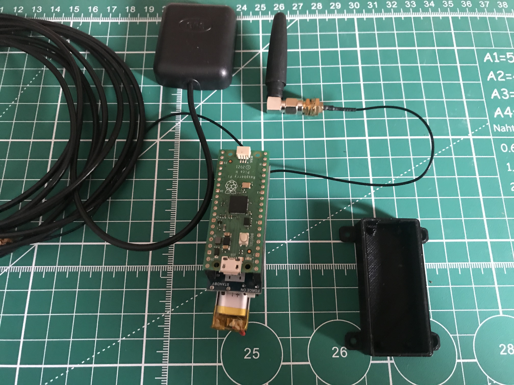
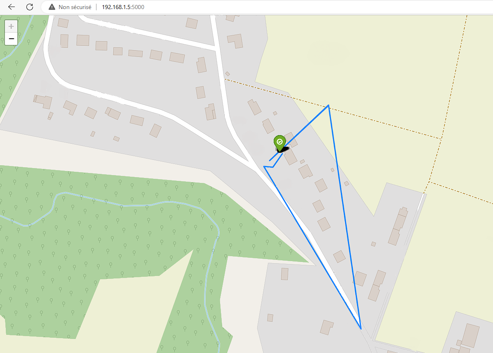

# LORA_GNSS_TRACKER

A tracker using GNSS localisation and transmitting the data by LORA communication.

Allow to transmit position until 10km // 2km in urban zone.

Transmitter :
    
    - Raspberry Pico
    - L76B GNSS Module for Raspberry Pi Pico (L76B GNSS Module for Raspberry Pi Pico)
    - Pico-LoRa-SX1262 (https://www.waveshare.com/wiki/Pico-LoRa-SX1262)
    - 3.3v Li-ion battery (For max 2 days of autonomy)

Instructions : 
     Follow this wiki for hardware connections : https://www.waveshare.com/wiki/Pico-LoRa-SX1262

    - Upload the content of /TX/ on the Pico, the main.py file will run automatically when Pico restart.

    

Receiver :
    
    - Raspberry Pi 3B
    - Raspberry Pico
    - Pico-LoRa-SX1262 (https://www.waveshare.com/wiki/Pico-LoRa-SX1262)
    Optionnal :
    - Li-ion battery charger regulator
    - 4 X Li-ion battery (3 days of autonomy)
    - SSD connected on USB3.0

    

Instructions :

    Upload the content of /RX/Pico/ on the Pico receiver and connect it by USB to the Raspberry Pi
    
    
    Display Map on receiver local network :
    
    - Install docker & docker-compose on the Raspberry Pi3B Receiver
    - Run "cd /RX && sudo docker-compose up -d"
    - Run " cd /RX && sudo python3 USB_BRIDGE.py"
    
    - Open your map in any browser on your local network by typing your Raspberry Pi IP address,
    
        The webserver listen on port 5000
        
        ex : "http://192.168.1.5:5000"

You can contact me for issues or questions at : bluelinemecanics@gmail.com
        
