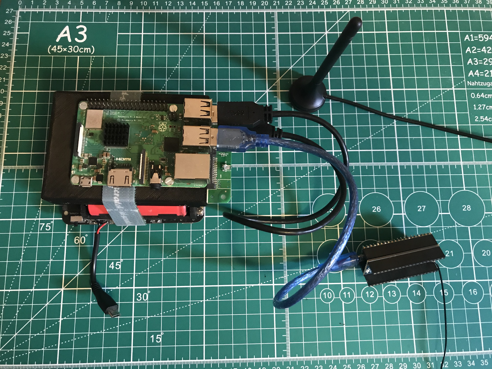

# LORA_GNSS_TRACKER
A tracker based on GNSS localisation and transmitting the data by LORA communication

Material used :

    Receiver  :
    - Raspberry Pi 3B
    - Raspberry Pico
    - Pico-LoRa-SX1262 (https://www.waveshare.com/wiki/Pico-LoRa-SX1262)
    Optionnal :
    - Li-ion battery charger regulator
    - SSD for Raspberry Pi 3B

    

    Transmitter :
    - Raspberry Pico
    - L76B GNSS Module for Raspberry Pi Pico (L76B GNSS Module for Raspberry Pi Pico)
    - Pico-LoRa-SX1262 (https://www.waveshare.com/wiki/Pico-LoRa-SX1262)
    - 3.3v Li-ion battery

